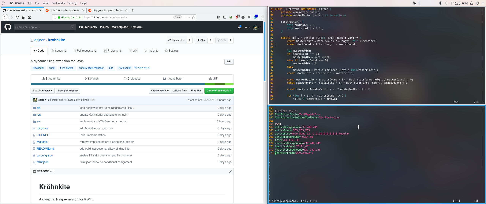

Kröhnkite
=========

A dynamic tiling extension for KWin.

Kröhnkite is mainly inspired by [dwm][] from suckless folks, and aims to be
"simple" in both development and usage.

[dwm]: https://dwm.suckless.org/
[Typescript]: https://www.typescriptlang.org/

Prerequisite
------------

 * Typescript (tested w/ 3.1.x)
 * GNU Make
 * p7zip (7z)

Build & Install
---------------

You can install Kröhnkite in multiple ways.

The simplest method would be:

    make install

This will automatically build and install kwinscript package. Note that you can
manually build package file using `make package`. The generated package file
can be imported from "KWin Script" dialog in "System Settings".

### Simply Trying Out ###

If you don't want to install the script, but still want to try, you can:

    make run
    make stop

to temporarily load (and unload) the script to KWin. You may also want to
restart KWin w/:

    kwin_x11 --replace

New instance will replace the current one, and print debugging message(i.e.
`console.log`) to terminal. This is useful for testing and debugging.

### Enabling User-Configuration ###

[It is reported][kwinconf] that a manual step is required to enable configuration of KWin
scripts. This is a current limitation of KWin scripting envrionment.

To enable configuration, you must perform the following in command-line:

    mkdir -p ~/.local/share/kservices5/
    cp ~/.local/share/kwin/scripts/krohnkite/metadata.desktop ~/.local/share/kservices5/krohnkite.desktop

A configuration button will appear in `KWin Scripts` in `System Settings`.

[kwinconf]: https://github.com/faho/kwin-tiling/issues/79#issuecomment-311465357

Default Key Bindings
--------------------

| Key               | Action                         |
| ----------------- | ------------------------------ |
| Meta + J          | Focus Down/Next                |
| Meta + K          | Focus Up/Previous              |
| Meta + H          | Left                           |
| Meta + L          | Right                          |
|                   |                                |
| Meta + Shift + J  | Move Down/Next                 |
| Meta + Shift + K  | Move Up/Previous               |
| Meta + Shift + H  | Move Left                      |
| Meta + Shift + L  | Move Right                     |
|                   |                                |
| Meta + I          | Increase                       |
| Meta + D          | Decrease                       |
| Meta + F          | Toggle Floating                |
| Meta + \          | Cycle Layout                   |

Tips
----

### Removing Title Bars ###

1. `System Setting` > `Application Style` > `Window Decorations`
2. Click `Configure Breeze` inside the preview.
3. `Window-Specific Overrides` tab > `Add` button
4. Enter the following:
   - `Regular expression to match`: `.*`
   - Check `Hide window titel bar`

(Note: not all decorations support this feature.)

### Changing Border Colors ###

Changing the color of borders makes it easier to identify the currently focused
window.  This is quite an essential if title bars are removed.

1. Open `~/.config/kdeglobals` with your favoir editors. (i.e. Kate, Vim, Nano)
2. Scroll down and find `[WM]` section
3. Below the section, append the followings:
    - `frame=61,174,233`: set the border color of active window to *RGB(61,174,233)*
    - `inactiveFrame=239,240,241`: set the border color of inactive window to *RGB(239,240,241)*
4. You must **restart** your session to see changes. (i.e. re-login, reboot)

(Note: the RGB values presented here is for the default Breeze theme. Feel free
to change these values. You can use [KColorChooser][] to pick colors from the
screen.)

[KColorChooser]: https://www.kde.org/applications/graphics/kcolorchooser/

### Setting Up for Multi-Screen ###

Krohnkite supports tiling on multi-screen environment, but users must configure
KWin to unlock the full potential of tiling management.

1. Switching between Screens
    - `Separate Screen Focus` option is required to enable 
      `Switch to Next/Previous Screen` shortcuts, which allow switching b/w
      screens only with keys.
    - The option can be found under `Window Management` > `Window Behavior` >
      `Multiscreen Behaviour`. Note that this option appears only when more
      than one monitor is present.
    - `Active Screen follows Mouse` is **NOT** recommended.
2. Switching with Shortcuts
    - In `Global Shortcut`, you can find `Switch to Next Screen` and 
      `Switch to Previous Screen`. They have no default key bindings.
    - It's recommended to bind them to `Meta + ,` and `Meta + .`.
    - Switching b/w screens also sets the active window to the last
      active window on the current screen.

Useful Development Resources
----------------------------

 * [KWin Scripting Tutorial](https://techbase.kde.org/Development/Tutorials/KWin/Scripting)
 * [KWin Scripting API 4.9 Reference](https://techbase.kde.org/Development/Tutorials/KWin/Scripting/API_4.9)
 * KDE API Reference
    - [KWin::Workspace Class](https://api.kde.org/4.x-api/kde-workspace-apidocs/kwin/html/classKWin_1_1Workspace.html)
    - [KWin::Toplevel Class](https://api.kde.org/4.x-api/kde-workspace-apidocs/kwin/html/classKWin_1_1Toplevel.html)
    - [KWin::Client Class](https://api.kde.org/4.x-api/kde-workspace-apidocs/kwin/html/classKWin_1_1Client.html)
 * Adding configuration dialog
    - [Development/Tutorials/Plasma/JavaScript/ConfigDialog](https://techbase.kde.org/Development/Tutorials/Plasma/JavaScript/ConfigDialog)
    - [Development/Tutorials/Using KConfig XT](https://techbase.kde.org/Development/Tutorials/Using_KConfig_XT)
 * `*.ui` files can be edited with [Qt Designer](http://doc.qt.io/qt-5/qtdesigner-manual.html).
   It's very straight-forward if you're used to UI programming.
